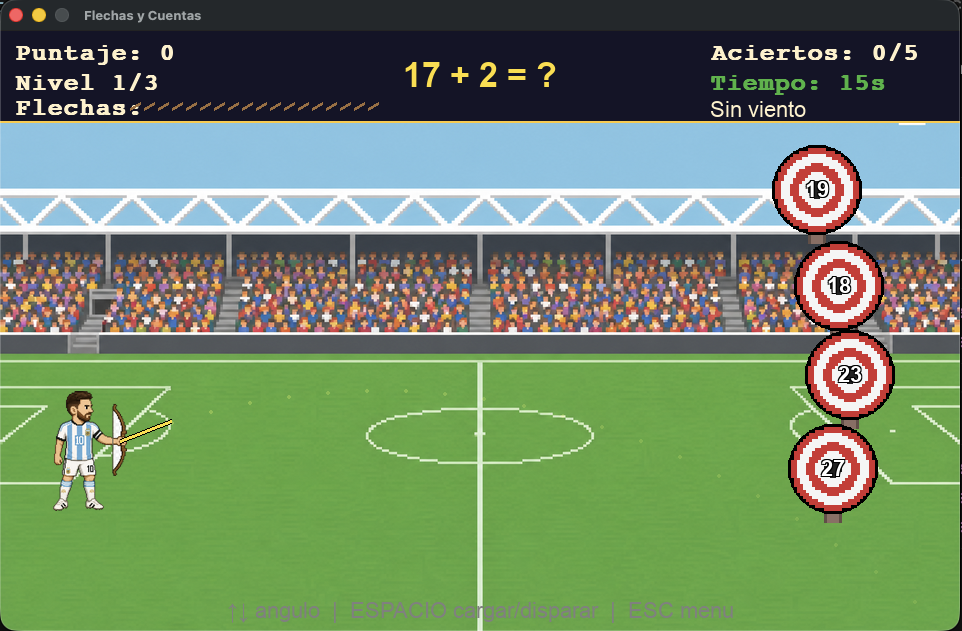

# Trabajo Práctico Integrador – Videojuegos

## Documento académico y reflexión final

---

**Materia:** Programación 2  **|**  **Comisión:** B  **|**  **Grupo:** 14  **|**  **Año:** 2026  
**Integrantes:** Franco Fernández Sica · Kevin Gómez  
**Proyecto:** *Flechas y Cuentas* — videojuego de arquería con temática de fútbol para la práctica de cálculo mental

---

## 1. Descripción del proyecto

**Flechas y Cuentas** es un videojuego 2D desarrollado en **Python 3** con la librería **pygame**. El jugador controla un futbolista inspirado en nuestro Messi, que dispara flechas dentro de un estadio: en cada ronda aparece una operación matemática y hay que pegarle al blanco que muestra la respuesta correcta.



El aprendizaje está en el núcleo de la mecánica, no se puede avanzar sin resolver bien las cuentas. Y la ambientación futbolística actúa como gancho motivacional, haciendo el ejercicio más atractivo para un público amplio.

## 2. Modalidad educativa y reglas

**Contenido:** cálculo mental (sumas, restas, multiplicaciones, divisiones y operaciones combinadas).

**Mecánica principal:** ajustar ángulo (↑/↓) y potencia (ESPACIO), disparar la flecha al blanco correcto. Acertar suma puntos con bonus por velocidad; errar o quedarse sin tiempo descuenta flechas. Al agotar las flechas es *Game Over*; completar los 3 niveles es *Victoria*.

**Sistema de puntaje:** visible en todo momento en el HUD junto con el nivel, flechas disponibles, aciertos, tiempo restante e indicador de viento.

## 3. Diseño de niveles y dificultad gradual

| Nivel | Operaciones               | Blancos                         | Viento     | Tiempo | Escenario            |
|-------|---------------------------|---------------------------------|------------|--------|----------------------|
| 1     | Suma y resta              | Flotación leve                  | Sin viento | 20 s   | Estadio de día       |
| 2     | Multiplicación / división | Movimiento vertical + flotación | Leve       | 18 s   | Estadio al atardecer |
| 3     | Operaciones mixtas        | Movimiento rápido + flotación   | Fuerte     | 15 s   | Estadio de noche     |

La dificultad crece en tres ejes: **cognitivo** (complejidad de las operaciones), **de puntería** (movimiento de blancos y viento creciente) y **de tiempo** (menos segundos y flechas por nivel).

## 4. Arquitectura del código

El proyecto respeta la estructura sugerida en la consigna:

```
flechas-y-cuentas/
├── lib/        Color.py · Var.py · Core.py · Entidades.py · Niveles.py · Assets.py · Audio.py
├── Sprite/     Personaje/ · Enemigos/ · Obstaculos/ · Fondos/
├── Sonidos/    7 efectos .wav sintetizados por código
├── Main.py     · Creditos.py
```

**Clases principales:** `Core` (bucle y estados), `EstadoJuego` (lógica de partida), `Arquero` (personaje), `Flecha` (físca de proyectil), `Blanco` (objetivos con flotación senoidal), `ConfigNivel` (parámetros por nivel orientados a datos).

**Colisiones:** detección por distancia euclidiana flecha↔centro de blanco.

**Audio:** 7 efectos de sonido (disparo, acierto, error, fallo, nivel, victoria, game over) **sintetizados por código propio** con la librería estándar de Python (`wave`, `math`, `struct`), sin recursos de terceros. El módulo es tolerante a fallos: si no hay salida de audio el juego continúa sin cerrarse.

## 5. Buenas prácticas aplicadas

- Separación de responsabilidades en módulos cohesivos dentro de `lib/`.
- Constantes centralizadas en `Color.py` y `Var.py` (sin números mágicos dispersos).
- Configuración de niveles orientada a datos: agregar un nivel no requiere modificar la lógica.
- Recursos de producción propia: sprites, fondos y sonidos elaborados por el grupo.
- Manejo de excepciones: el audio tolera la falta de salida de sonido, la carga de recursos informa con mensajes claros si falta un archivo, y el arranque del juego captura errores para cerrar de forma ordenada.

## 6. Reflexión final

Desarrollar este juego nos permitió integrar los contenidos de la cursada en un producto real: diseñar un sistema con estado, entidades que interactúan y un bucle de juego coherente. Entendimos en la práctica el valor de la **programación orientada a objetos** y la **separación en módulos**, cambiar una regla o agregar un nivel se reduce a tocar configuración, no lógica central.

En cuanto al valor educativo, la fortaleza de *Flechas y Cuentas* está en que **no se puede ganar sin resolver bien las operaciones**: el aprendizaje es condición de avance, no decoración. La presión del tiempo, la dificultad progresiva y la ambientación futbolística aportan la motivación que, según la gamificación, mejora la adherencia del estudiante.

## 7. Declaración de uso de Inteligencia Artificial

En conformidad con las pautas del TP, declaramos que parte de la estructura y del código fue asistida por herramientas de IA (Cursor / Claude). El uso se limitó a apoyo técnico y documentación. El diseño del juego, las decisiones pedagógicas, las pruebas y la integración final son producción propia del grupo.

---

*Franco Fernández Sica · Kevin Gómez — Comisión B — Grupo 14 — Programación 2 — 2026*
